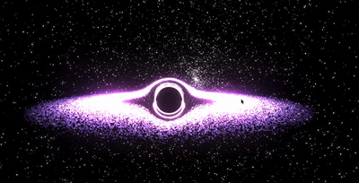

# Blackhole

<p align="center">
  
</p>

<p align="center">
  <a href="https://github.com/awmie/blackhole">
    
  </a>
  <a href="https://github.com/awmie/blackhole">
    
  </a>
  <a href="https://github.com/awmie/blackhole">
    
  </a>
  <a href="https://github.com/awmie/blackhole">
    
  </a>
</p>

A real-time 3D blackhole simulation built with Three.js and Next.js. Watch as planets and stars orbit the event horizon, get absorbed by gravity, and trigger spectacular Hawking radiation jets.

## Features

- **Gravitational Lensing** - Real-time shader-based lensing effect distorting background stars
- **Accretion Disk** - Customizable glowing disk with adjustable inner/outer radius and opacity
- **Orbital Physics** - Planets and stars orbit with velocity based on distance from the blackhole
- **Object Spawning** - Click to spawn planets or stars at any position in the accretion disk
- **Hawking Radiation Jets** - Trigger relativistic jets after absorbing enough matter (7 stars or 12 planets)
- **Collision System** - Objects collide and dissolve on impact
- **Interactive Controls** - Real-time adjustment of blackhole size, disk parameters, camera, and simulation speed

## Getting Started

### Prerequisites

- Node.js 18+
- npm or yarn

### Installation

```bash
git clone https://github.com/awmie/blackhole.git
cd blackhole
npm install
```

### Run Development Server

```bash
npm run dev
```

Open [http://localhost:9002](http://localhost:9002) in your browser.

## Controls

### Spawning Objects

- **Left Click** - Spawn selected object type at cursor position
- **Right Panel** - Use "Spawn Object" button to spawn at random position

### Control Panel

- **Black Hole Radius** - Adjust the size of the event horizon
- **Accretion Disk Inner/Outer Radius** - Customize the disk boundaries
- **Disk Opacity** - Adjust glow intensity
- **Simulation Speed** - Speed up or slow down time
- **Object Type** - Toggle between spawning planets or stars

### Camera

- **Left Click + Drag** - Rotate camera around the blackhole
- **Scroll** - Zoom in/out

## Tech Stack

- [Next.js 15](https://nextjs.org/) - React framework
- [Three.js](https://threejs.org/) - 3D graphics
- [TypeScript](https://www.typescriptlang.org/) - Type safety
- [Tailwind CSS](https://tailwindcss.com/) - Styling
- [Radix UI](https://www.radix-ui.com/) - UI components

## License

MIT License - see [LICENSE](LICENSE) for details.

---

Built with 💜 by [awmie](https://github.com/awmie)
